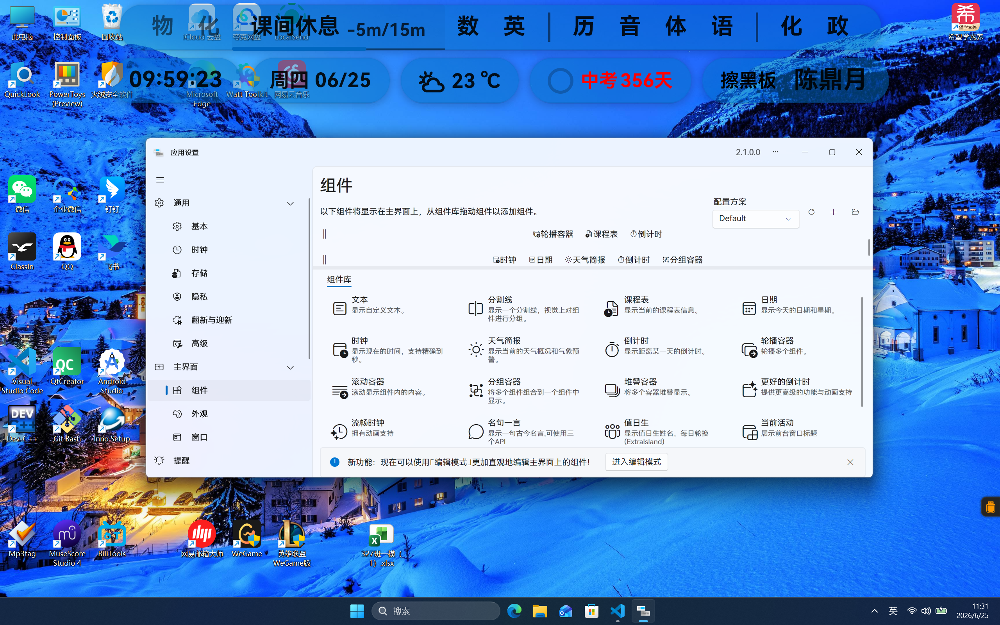

# 每个班级都应该拥有ClassIsland

> ClassIsland的 [官网](https://www.classisland.tech/) | [GitHub源码仓库](https://github.com/ClassIsland/ClassIsland) | [Bilibili](https://space.bilibili.com/355897687)

## 简述

ClassIsland是一款**班级大屏课表软件**，隶属于智教联盟。
- **功能丰富**
- **轻量**
- **插件生态丰富**
- **开源**
- **跨平台**

这款软件依据**GPL v3开源**，这意味着它是，且将**永远**是，**免费提供的**。

> 开源，即开放源代码。开源软件的开发者会**将软件的代码开放**，任何人都可以访问。
> 
> 开源协议就是规范**软件使用者的权利义务**的一个文档，**具有法律效益**。它可以由开发者可以自行编写，也可以直接使用一些组织发布的通用模板。GPL v3就是由自由软件基金会发布的一个模板，它的大致内容：
>
> - **传染性（Copyleft）**：衍生作品必须在相同许可证下发布，确保后续版本继续保持自由。
>
> - 可商用：允许商业使用和销售，但**必须提供源代码及相同的自由**。~~(商用也要开源，这怎么赚钱)~~
>
> - 专利授权：贡献者**自动授予**必要的专利许可，防止专利诉讼限制软件自由。
>
> - **反“锁机”条款**：禁止硬件制造商阻止用户安装修改版软件（如某些嵌入式设备）。
>
> - **反规避条款**：不允许利用 DRM 或技术保护措施剥夺用户修改和运行软件的权利。

## 功能

#### 课表信息显示

- 显示**课表、当前课程信息**
- 上下课等时间点**发出**[**提醒**](https://docs.classisland.tech/app/notifications)
- 课表**按条件隐藏**
- 主界面**临时隐藏与鼠标穿透**

#### 课表编辑与管理

- [课表**编辑工具**](https://docs.classisland.tech/app/classplan)
- [**导入**课表](https://docs.classisland.tech/app/profile/#%E4%BB%8E%E8%A1%A8%E6%A0%BC%E5%AF%BC%E5%85%A5)
- Excel**导出**课表
- **多周轮换**
- 单日/跨天**换课**
- 提前**预定要临时启用**的课表

#### 自定义

- [**组件**](https://docs.classisland.tech/app/basic#组件)自定义显示的内容：多行显示组件、组件轮播、组件滚动
- [**插件**](https://docs.classisland.tech/app/basic#组件)
- **主题**系统（个人觉得不太好用）

#### 其它功能

- 自定义[**自动化**](https://docs.classisland.tech/app/automation.html)：在特定事件发生时/特定时间自动执行某些操作，如显示提醒、打开应用等，提高教学效率
- 显示[**天气**](https://docs.classisland.tech/app/advanced#天气)信息、降水提示、天气预报、极端天气预警
- 同步软件**时间**
- 调整**时间偏移**，手动**对齐铃声**
- 密码等**保护**应用设置和课表配置
- **自动更新**

详细介绍见ClassIsland的**官方**[**文档**](https://docs.classisland.tech/)

## 校级合作的可行性

**法律上**，ClassIsland隶属的**品牌**[**中国智教联盟**](https://github.com/SmartteachCN)属于[天津静海汇智卓创文化发展有限公司](https://www.smart-teach.cn/about/)（简称**汇智卓创**），因此可以学校层面可以以**与民营企业合作**的方式**方便的**引入ClassIsland。已有上海、厦门、衡水等**几十个城市**的[**33个学校**](https://smartteachcn.feishu.cn/app/NWZnbEs9paQMmVsdOLFcrJF8n6b?pageId=pge9I1OesafFHSka)与汇智卓创**达成了合作**。学校也**可以**自己**Fork**一份代码。

~~**实际上**就是ClassIsland的开发者搞了个“智教联盟”，后来智教联盟的成员为了方便买域名、搞合作之类的，又开了一家没啥实际业务的公司。~~

## 安装

> 2.0及以上使用了**Avalonia**，已**不支持**Windows 7。要在Windows 7上使用ClassIsland，请前往GitHub下载**以前的**[**1.7.0.1版本**](https://github.com/ClassIsland/ClassIsland/releases/tag/1.7.0.1)或更低版本。

- [**官网**直连下载](https://www.classisland.tech/download)。不同于其他大多数的个人开发的软件，ClassIsland毕竟是背靠汇智卓创的，汇智卓创和一个叫苏州晔淞信息科技有限公司的云服务商有合作，所以官网可以直连下载，而且服务器在境内，**很快**。~~听不懂就直接**点开、下载**就行了~~

- ~~如果你有魔法可以上GitHub的话，~~ 你也可以去[**GitHub Release**](https://github.com/ClassIsland/ClassIsland/releases/latest)下载。

ClassIsland 2.0及以上是**跨平台**的，支持
- **Windows** 10 及以上
- **Linux** Debian 10 或其衍生版
- **MacOS** Big Sur 11 及更高版本

请安装时注意选择**正确的文件**

## 使用指南

2.1.0.0 更新了一个**教学**功能，直接下载下来**跟着学一遍**就行了，我就懒得写指南了。

我强烈建议在自家电脑上学完`教学`再来学校，因为一个课间看不完（bushi

ClassIsland个性化程度很高。以组件配置为例，除了像文章开头那样丰富，也可以设置的简单一些，例如

